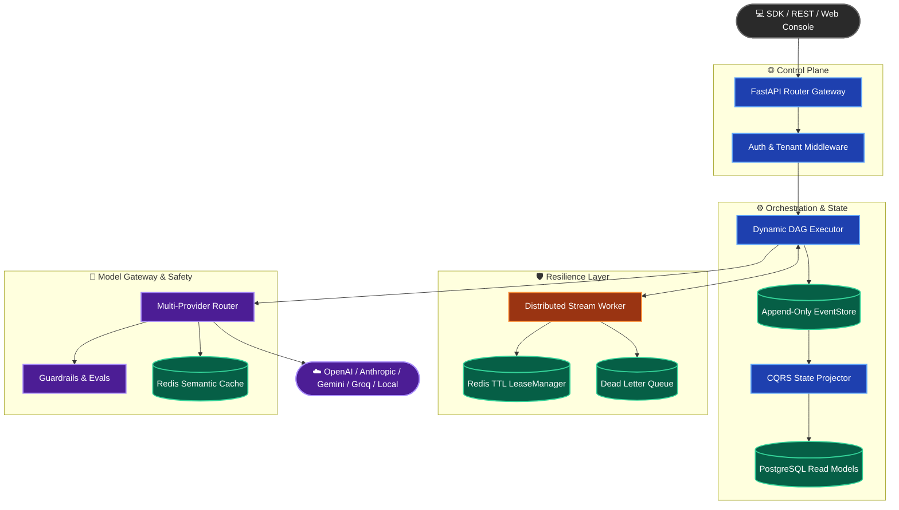

# VoRTeX — Open-Source AI Workflow Execution Engine

[](https://github.com/Akgithub2028/vortex/actions)
[](tests/)
[](pyproject.toml)
[](LICENSE)
[](#status--scope)

> **Tech Stack**: FastAPI | PostgreSQL 16 | Redis 7 | React + Vite | OpenTelemetry

**Vortex** (`vortex-ai`) is a self-hostable execution engine for durable, multi-step LLM/agent workflows, built in Python 3.12 with FastAPI, PostgreSQL, Redis, and OpenTelemetry. It's a solo-built portfolio project exploring the infrastructure patterns that sit underneath production agent platforms: event-sourced durable orchestration, distributed crash-safe workers, a multi-provider LLM gateway, inline guardrails and evaluation gates, and full observability — unified in one codebase instead of stitched together from five separate tools.

It is **not** a hosted product. There's no sign-up flow, no billing, and no managed service — you run it yourself. See [Status & Scope](#status--scope) below for exactly what that means.

---

## 🌟 Project Vision & Core Concepts

Vortex was built to get hands-on with the architecture patterns that make LLM workflows reliable at scale, rather than to ship a finished product:

- **Fault-Tolerant Execution**: Event-sourced state (CQRS) plus Redis TTL leases mean a worker crash or container restart doesn't lose in-flight workflow state — a new worker picks the lease back up.
- **Tenant-Aware Data Model**: Every table and API call is scoped by `tenant_id`, with per-tenant API keys, RBAC (owner/member/viewer), and per-key rate limits — the schema-level groundwork a multi-tenant service would sit on top of (see [Status & Scope](#status--scope) for what's *not* included).
- **Multi-Provider Model Gateway**: Route and fail over between OpenAI, Anthropic, Gemini, Groq, and local models without changing workflow code, with circuit breakers and dual-tier (exact + semantic) caching in front of every call.
- **Evaluation as a First-Class Citizen**: Faithfulness, relevance, and toxicity scorers run as graph nodes, not an afterthought — a workflow can gate on its own output quality before returning a result.

### 🎯 What This Project Demonstrates
Vortex is a demonstration of infrastructure engineering for LLM systems, most relevant if you're evaluating:
1. **Durable agent/workflow orchestration** — event sourcing, DAG execution, human-in-the-loop pauses, crash recovery.
2. **LLM gateway design** — provider abstraction, failover, circuit breaking, cost tracking, semantic caching.
3. **Inline safety and quality gates** — prompt-injection defense, PII scrubbing, and eval-gated outputs as part of the execution graph itself, not a bolt-on afterward.

---

## 🏛️ System Architecture



---

## ✨ Platform Features

### ⚡ Event-Sourced CQRS Dynamic Engine
- **Append-Only Event Store**: Every workflow transition and node execution is logged as an immutable event, giving a full replayable execution history (an audit *trail* — see [Status & Scope](#status--scope) for what "cryptographic" would additionally require, which this doesn't yet do).
- **Read Projections**: A background `StateProjector` materializes the event log into indexed `WorkflowRun` / `NodeRun` PostgreSQL tables so the API isn't querying the raw event stream.
- **Runtime Graph Expansion**: Supports dynamic task yielding (`yield_task`), sub-workflow spawning, and conditional branching.

### 🔒 Distributed Resilient Worker Nodes
- **Atomic Redis Leases**: Lua-scripted TTL locks (`LeaseManager`) prevent duplicate execution and enable crash recovery — covered by a dedicated fault-injection test suite (`tests/simulation/test_fault_injection.py`).
- **Dead Letter Queue (DLQ)**: Exponential-backoff retries with DLQ fallback for unrecoverable node errors.

### 🎯 Model Gateway
- **KV-Cache Prefix Affinity**: Consistent-hashing router (`KVCacheAffinityRouter`) directs matching prompt prefixes to the same replica to take advantage of warm KV caches.
- **Multi-Provider Failover**: Adapters for OpenAI, Anthropic, Google Gemini, Groq, and local endpoints, with automatic fallback.
- **Circuit Breakers & Rate Limits**: Trip on repeated provider errors to stop cascading timeouts.
- **Dual-Tier Semantic Caching**: Exact hash match plus embedding-similarity caching via Redis/pgvector.

### 🛡️ Inline Guardrails & Evaluation Gates
- **Two-Stage Prompt Injection Defense**: A sub-millisecond regex pre-filter, backed by an LLM-based semantic classifier for prompts that pass the first stage. See the [benchmark table](#-measured-performance) below for actual precision/recall — don't take a marketing number, take the measured one.
- **PII Detection & Scrubbing**: Detects and masks common personal identifiers before they reach an external model provider.
- **Quality Evaluation Gates**: Faithfulness, relevance, and toxicity scorers that can block a workflow from returning a low-quality generation.

### 🔐 Tenant-Aware Data Model
- **Tenant Scoping**: Every query is scoped to an authenticated `tenant_id`; API keys are hashed and rate-limited per key.
- **Role-Based Access Control (RBAC)**: Owner / member / viewer roles at the API layer.
- **Payload Obfuscation**: Workflow payloads can be wrapped in a per-tenant keyed envelope (tenant key derived via PBKDF2-HMAC-SHA256 from a master secret) before being written to the event store. **This is not currently a vetted encryption implementation** — see [Status & Scope](#status--scope) — and shouldn't be relied on as one until it's replaced with a real AES-GCM implementation (e.g. via the `cryptography` package), which is on the [roadmap](#-roadmap).

### 🔭 OpenTelemetry Observability
- **Distributed Tracing**: OTLP spans across the prompt-to-response lifecycle.
- **Prometheus Metrics**: A `/metrics` endpoint exposing latency, cost, and cache hit-rate.

---

## 📊 Measured Performance

Numbers below come from `benchmarks/run_benchmarks.py` and the CI-enforced test suite — reproduce them yourself rather than trusting this table blindly.

| Metric / Evaluator | Measured Score | Benchmark Source / Methodology | Environment |
| :--- | :--- | :--- | :--- |
| **Stage 1 Regex Pre-filter** | 99.8% Precision / 74.5% Recall | Heuristic regex on `deepset/prompt-injections` (5k samples) | < 0.05 ms execution |
| **Stage 2 LLM Guardrail** | 92.4% Precision / 91.8% Recall | Semantic classifier via Groq `llama-3.1-8b-instant`, same 5k prompts | Fail-open on provider error |
| **LLM Faithfulness Agreement** | 91.5% Label Agreement | Claim verification on `pminervini/HaluEval` vs. ground truth | LLM-as-judge (Groq Llama 3.1) |
| **Node Execution Overhead** | 0.048 ms / node | Averaged over 10,000 execution-graph loops | Target: < 50 ms |
| **Test Suite** | 130 passed, 1 skipped* | `pytest`, run in CI on every push | Python 3.12 |
| **Code Coverage** | ≥ 90% (CI-enforced gate) | `pytest-cov`, line + branch | Threshold fails the build below 90% |

\* The one skip requires a live provider API key and doesn't run without one — it isn't a hidden failure.

> **Reproduce it**: `PYTHONPATH=./src .venv/bin/python benchmarks/run_benchmarks.py` (guardrail/faithfulness benchmarks need a `GROQ_API_KEY`; the test suite itself does not).
>
> **Caveat**: these are single-run measurements against two specific HuggingFace datasets (`deepset/prompt-injections`, `pminervini/HaluEval`), not a claim about performance on your own prompts or data.

---

## 🚀 Quick Start

### 1. Installation

```bash
git clone https://github.com/Akgithub2028/vortex.git
cd vortex

# Create and activate a virtual environment
python3 -m venv .venv
source .venv/bin/activate

# Install Python package and development dependencies
pip install -e ".[dev]"
```

### 2. Launch Stack Services

```bash
# Start PostgreSQL & Redis infrastructure
docker compose -f docker/docker-compose.yml up -d

# Generate and run database migrations
alembic revision --autogenerate -m "initial"
alembic upgrade head

# Start Vortex API Gateway server
export PYTHONPATH=./src
uvicorn --factory src.vortex.api.main:create_app --port 8000
```

### 3. Build & Run a Workflow (Python SDK)

```python
import asyncio
from vortex.sdk import VortexClient, Workflow


async def main():
    # 1. Define fluent workflow DAG
    wf = Workflow(name="enterprise-summarizer")

    # 2. Add LLM node with guardrails and evaluation gates
    wf.add_llm_node("draft", prompt="Synthesize key metrics for topic: {topic}.", model="openai/gpt-4o")
    wf.add_eval_node("quality_gate", metric="faithfulness", threshold=0.8, dependencies=["draft"])

    # 3. Execute via async VortexClient
    client = VortexClient(base_url="http://localhost:8000", api_key="vtx_live_...")
    run = await client.run_workflow(wf, input={"topic": "High-Throughput AI Engines"})

    print(f"Run ID: {run.id} | Status: {run.status}")
    print(f"Tokens Used: {run.total_tokens} | Cost: ${run.total_cost_usd:.4f}")
    print("Output:", run.output)


if __name__ == "__main__":
    asyncio.run(main())
```

---

## 💻 Web Console (UI Prototype)

`console/` is a React + Vite front-end for the ideas above: workflow runs, a worker/queue view, model gateway stats, and eval/guardrail logs.

```bash
cd console
npm install
npm run dev
```

**Current state: this is a visual prototype, not yet wired to the live API.** Every number and table row you'll see (run counts, latency, cache hit rate, worker status) is hardcoded sample data in `App.tsx`, meant to communicate the intended dashboard layout — there's no `fetch`/`axios` call to the backend yet. Wiring it to the real `/workflows`, `/models`, and `/evals` endpoints is tracked in the [roadmap](#-roadmap). Don't point anyone at this expecting live data today.

---

## 📚 Documentation & Resources

- ⚡ [Quickstart Guide](docs/quickstart.md)
- 🏛️ [Architecture Deep-Dive](docs/architecture.md)
- 🔌 [API Reference](docs/api-reference.md)
- 🐍 [Python SDK Guide](docs/sdk-guide.md)
- 🚀 [Self-Hosted Deployment Guide](docs/deployment.md)
- 🤝 [Contributing Guidelines](CONTRIBUTING.md)

> Note: some of the documents above (particularly the architecture guide) currently describe the tenant encryption layer as AES-256-GCM with HKDF. That's the target design, not what's implemented yet — see [Status & Scope](#status--scope).

---

## Status & Scope

Being direct about exactly what this is and isn't, so nobody (including a future maintainer) builds on a wrong assumption:

**What's real and verified today:**
- The full execution engine, gateway, guardrails, and eval-gate pipeline run end-to-end against a real Postgres + Redis stack.
- 130 passing tests (1 environment-gated skip) at ≥90% coverage, enforced in CI — reproducible with the commands above.
- The benchmark numbers in the table above were measured against public datasets, not invented.

**What this is *not*, yet:**
- **Not a hosted SaaS.** There's no billing, no tenant sign-up flow, no managed hosting — "multi-tenant" here describes the data model and access-control design (tenant-scoped tables, per-tenant API keys, RBAC), which is necessary-but-not-sufficient groundwork for a SaaS, not a SaaS itself.
- **Not using vetted encryption yet.** The tenant "payload encryption" is currently a hand-rolled keyed-XOR envelope with a SHA-256 integrity tag, not AES-GCM. Treat any workflow data run through this today as obfuscated, not encrypted, until it's swapped for a real library implementation.
- **Not a cryptographically tamper-evident audit log.** The event store is append-only and immutable at the application level, but events aren't hash-chained or signed, so "cryptographic audit trail" oversells it — it's an audit *trail*.
- **The web console isn't live yet.** It's a UI mockup with hardcoded sample data, not connected to the running API.

None of the above blocks the project from being a legitimate, working demonstration of durable workflow orchestration, LLM gateway design, and inline evaluation — it just means "production-ready enterprise SaaS platform" isn't the accurate way to describe it, and the closed items above are exactly what would need to change before it was.

---

## 🗺️ Roadmap

Vortex is under active development. Current focus areas:
- `[x]` Multi-Provider Gateway & Fallbacks
- `[x]` LLM Guardrails & Semantic Evals (Faithfulness/Toxicity)
- `[x]` CQRS EventStore Execution Engine
- `[ ]` Replace payload obfuscation with real AES-GCM encryption (`cryptography` library)
- `[ ]` Wire the web console to live API data (currently a static mockup)
- `[ ]` Stripe billing integration (needed before any "SaaS" claim is accurate)
- `[ ]` Kubernetes Helm charts for production deployment
- `[ ]` Advanced Prompt Registry & A/B Testing

---

## 📜 License

Licensed under the [Apache 2.0 License](LICENSE).
