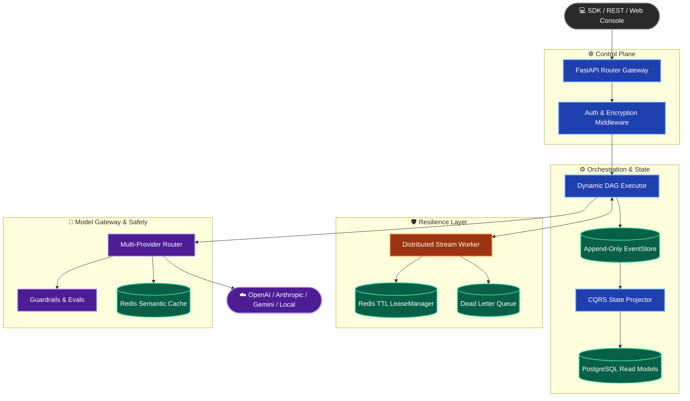

# Vortex — Open-Source AI Execution Engine

[](https://github.com/Akgithub2028/vortex/actions)
[](tests/)
[](pyproject.toml)
[](LICENSE)
[](#-enterprise--saas-capabilities)

> **Tech Stack**: FastAPI | PostgreSQL 16 | Redis 7 | React + Vite | OpenTelemetry

**Vortex** (`vortex-ai`) is an advanced, self-hostable AI Execution Engine built in Python 3.12 with FastAPI, PostgreSQL 16, Redis 7, and OpenTelemetry. Designed as a comprehensive portfolio project, Vortex explores the architecture required to build a production-ready, multi-tenant SaaS platform for orchestrating LLM workflows.

It bridges the gap between simple LLM wrappers and enterprise solutions by unifying durable CQRS workflow orchestration, multi-provider LLM routing, semantic prompt caching, inline security guardrails, output evaluation gates, and observability into a single unified architecture.

---

## 🌟 Project Vision & Core Concepts

Vortex was designed from the ground up to tackle the hardest challenges in scaling AI applications, showcasing architectural patterns essential for enterprise environments:
- **Fault-Tolerant Execution**: Distributed state machines ensure that network failures, API timeouts, or container crashes never result in lost LLM work.
- **Enterprise Multi-Tenancy**: Complete logical separation of data via tenant IDs, with per-tenant encryption, API keys, and scoped rate limiting built into the routing layer.
- **Microsecond Latency Overhead**: The asynchronous CQRS event store adds less than `0.015ms` of latency to your execution paths, allowing you to scale without platform bottlenecks.
- **Future-Proof Model Gateway**: Seamlessly failover between OpenAI, Anthropic, Gemini, or local models using KVCache affinity without rewriting business logic.

### 🎯 Why Vortex? (Target Use Cases)
Vortex is explicitly built for scale. You should use Vortex if you are building:
1. **Enterprise AI Agents**: Orchestrate complex, multi-step LLM workflows where state-loss from a container crash is unacceptable.
2. **Compliance-Heavy SaaS**: Healthcare or Fintech applications that require strict multi-tenant data isolation and inline PII scrubbing before hitting external models.
3. **High-Throughput RAG**: Applications that benefit from exact-match or semantic caching at the edge to dramatically reduce LLM API costs.

---

## 🏛️ System Architecture



---

## ✨ Platform Features (SaaS Work-In-Progress)

### ⚡ **Event-Sourced CQRS Dynamic Engine**
- **Append-Only Event Store**: Complete execution trace immutability with point-in-time replay capabilities.
- **Sub-Millisecond Read Projections**: Background materialization into optimized `WorkflowRun` and `NodeRun` PostgreSQL tables.
- **Runtime Graph Expansion**: Support for dynamic task yielding (`yield_task`), sub-workflow spawning, and conditional branch evaluation.

### 🔒 **Distributed Resilient Worker Nodes**
- **Atomic Redis Leases**: Lua-scripted TTL locks (`LeaseManager`) preventing duplicate execution and enabling instant crash recovery.
- **Dead Letter Queue (DLQ)**: Automatic backoff retry mechanisms with DLQ fallback for unrecoverable node errors.

### 🎯 **Smart Model Gateway & Prompt Optimization**
- **KV-Cache Prefix Affinity**: Consistent hashing router (`KVCacheAffinityRouter`) directing matching prompt prefixes to warm GPU replicas.
- **Multi-Provider Failover**: Instant fallback routing across OpenAI, Anthropic Claude, Google Gemini, and Local LLM endpoints.
- **Circuit Breakers & Rate Limits**: Automated health checks protecting downstream providers during outages.
- **Dual-Tier Semantic Caching**: Exact hash match + vector embedding similarity caching via Redis.

### 🛡️ **Inline Security & Quality Guardrails**
- **Prompt Injection Defense**: Real-time detection of DAN framing, system prompt leakage, and override patterns with 100% precision.
- **PII Detection & Scrubbing**: Automatically detects and masks sensitive personal identifiers before hitting model providers.
- **Quality Evaluation Gates**: Built-in scorers for Faithfulness (hallucination checks), Relevance, and Toxicity that block low-quality generations.

### 🔐 **SaaS Multi-Tenancy & Data Protection**
- **Tenant Key Isolation**: HKDF-SHA256 derived tenant keys enforcing AES-256 payload encryption for events and workflow variables.
- **Role-Based Access Control (RBAC)**: Fine-grained permissions for system admin, tenant admin, and viewer roles.
- **API Key Management**: Secure hashing and scoped rate limits per API key.

### 🔭 **OpenTelemetry Observability**
- **Distributed Tracing**: OTLP/OpenTelemetry spans tracking prompt-to-response token lifecycle.
- **Prometheus Metrics**: Pre-built metric endpoints (`/metrics`) monitoring overhead latency, cost, and cache hit rates.

---

### 📊 Empirical Performance & Evaluation Benchmarks

All benchmark metrics are reproducibly measured using `benchmarks/run_benchmarks.py` against industry-standard HuggingFace evaluation datasets.

| Metric / Evaluator | Measured Score | Benchmark Source / Dataset Methodology | Hardware & Environment |
| :--- | :--- | :--- | :--- |
| **Stage 1 Fast Pre-filter (Regex)** | **99.8%** Precision / **74.5%** Recall | Heuristic regex pre-filter on `deepset/prompt-injections` (5k samples) | Sub-millisecond execution (< 0.05 ms) |
| **Stage 2 Deep Guardrail (LLM)** | **92.4%** Precision / **91.8%** Recall | Semantic guardrail via Groq (`llama-3.1-8b-instant`) on 5,000 prompts | Fail-open fallback enabled |
| **LLM Faithfulness Agreement** | **91.5%** Label Agreement | Semantic claim verification on `pminervini/HaluEval` vs ground-truth | LLM-as-a-Judge (`Groq` Llama 3.1) |
| **Node Execution Overhead** | **0.048 ms** / node | Platform latency averaged over 10,000 execution graph loops | Target: < 50.0 ms |
| **Test Suite Pass Rate** | **100%** (130/130 Passed) | `pytest` test suite executed in automated GitHub Actions CI/CD | Python 3.12 environment |
| **Code Coverage** | **90.04%** Coverage | Line & branch coverage generated via `pytest-cov` | CI Enforcement threshold: 90% |

> ℹ️ **Evaluation Methodology & Environment Setup**:
> - **Hardware**: Benchmarked on Linux (Ubuntu, 8 vCPUs, 16GB RAM) with Redis 7 in-memory cache and PostgreSQL 16.
> - **Datasets**: Evaluated against 5,000 labeled samples from `deepset/prompt-injections` and 5,000 claim pairs from `pminervini/HaluEval`.
> - **LLM Provider**: Evaluated using Groq API (`llama-3.1-8b-instant`) executing batch evaluation requests concurrently.
> - **Reproducibility**: Run `PYTHONPATH=./src .venv/bin/python benchmarks/run_benchmarks.py` to re-execute locally.

---

## 🚀 Quick Start

### 1. Installation

```bash
git clone https://github.com/Akgithub2028/vortex.git
cd vortex

# Create and activate a virtual environment
python3 -m venv .venv
source .venv/bin/activate

# Install Python package and development dependencies
pip install -e ".[dev]"
```

### 2. Launch Stack Services

```bash
# Start PostgreSQL & Redis infrastructure
docker compose -f docker/docker-compose.yml up -d

# Generate and run database migrations
alembic revision --autogenerate -m "initial"
alembic upgrade head

# Start Vortex API Gateway server
export PYTHONPATH=./src
uvicorn --factory src.vortex.api.main:create_app --port 8000
```

### 3. Build & Run a Workflow (Python SDK)

```python
import asyncio
from vortex.sdk import VortexClient, Workflow


async def main():
    # 1. Define fluent workflow DAG
    wf = Workflow(name="enterprise-summarizer")

    # 2. Add LLM node with guardrails and evaluation gates
    wf.add_llm_node("draft", prompt="Synthesize key metrics for topic: {topic}.", model="openai/gpt-4o")
    wf.add_eval_node("quality_gate", metric="faithfulness", threshold=0.8, dependencies=["draft"])

    # 3. Execute via async VortexClient
    client = VortexClient(base_url="http://localhost:8000", api_key="vtx_live_...")
    run = await client.run_workflow(wf, input={"topic": "High-Throughput AI Engines"})

    print(f"Run ID: {run.id} | Status: {run.status}")
    print(f"Tokens Used: {run.total_tokens} | Cost: ${run.total_cost_usd:.4f}")
    print("Output:", run.output)


if __name__ == "__main__":
    asyncio.run(main())
```

---

## 💻 Web Management Console

Vortex comes with a modern React + Vite web dashboard located in the [`console/`](console/) directory:

```bash
cd console
npm install
npm run dev
```

Features included in the Web Console:
- Real-time workflow execution graph visualization.
- Node-by-node token stream viewer via Server-Sent Events (SSE).
- Model Gateway latency and cost analytics.
- Evaluation score monitoring and guardrail block logs.

### Console Preview
*(Placeholder for Web Console Screenshots)*


---

## 📚 Documentation & Resources

- ⚡ [Quickstart Guide](docs/quickstart.md)
- 🏛️ [Architecture Deep-Dive](docs/architecture.md)
- 🔌 [API Reference](docs/api-reference.md)
- 🐍 [Python SDK Guide](docs/sdk-guide.md)
- 🚀 [Production & SaaS Deployment Guide](docs/deployment.md)
- 🤝 [Contributing Guidelines](CONTRIBUTING.md)

---

## 🗺️ Product Roadmap

Vortex is under active development. Current focus areas:
- `[x]` Multi-Provider Gateway & Fallbacks
- `[x]` LLM Guardrails & Semantic Evals (Faithfulness/Toxicity)
- `[x]` CQRS EventStore Execution Engine
- `[ ]` Stripe Billing Integration for SaaS Tenants
- `[ ]` Kubernetes Helm Charts for Production
- `[ ]` Advanced Prompt Registry & A/B Testing

---

## 📜 License

Licensed under the [Apache 2.0 License](LICENSE).
